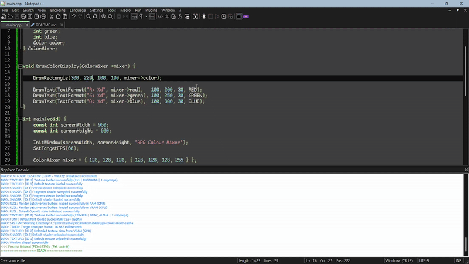

---

marp: true
---

# Gif of the Code Working




--- 

# Compiling
## **IF** Raylib is on the **C: Drive**, use this

---

```
echo > Setup required Environment
echo -------------------------------------
SET RAYLIB_PATH=C:\raylib\raylib
SET COMPILER_PATH=D:\raylib\w64devkit\bin
ENV_SET PATH=$(COMPILER_PATH)
SET CC=g++
SET CFLAGS=$(RAYLIB_PATH)\src\raylib.rc.data -s -static -O2 -std=c++17 -Wall -I$(RAYLIB_PATH)\src -Iexternal -DPLATFORM_DESKTOP
SET LDFLAGS=-lraylib -lopengl32 -lgdi32 -lwinmm
cd $(CURRENT_DIRECTORY)
echo
echo > Clean latest build
echo ------------------------
cmd /c IF EXIST $(NAME_PART).exe del /F $(NAME_PART).exe
echo
echo > Saving Current File
echo -------------------------
npp_save
echo
echo > Compile program
echo -----------------------
$(CC) --version
$(CC) -o $(NAME_PART).exe *.cpp $(CFLAGS) $(LDFLAGS)
echo
echo > Reset Environment
echo --------------------------
ENV_UNSET PATH
echo
echo > Execute program
echo -----------------------
cmd /c IF EXIST $(NAME_PART).exe $(NAME_PART).exe
```

---

## **IF** Raylib is on the **D: Drive**, use this

---

```
echo > Setup required Environment
echo -------------------------------------
SET RAYLIB_PATH=D:\raylib\raylib
SET COMPILER_PATH=D:\raylib\w64devkit\bin
ENV_SET PATH=$(COMPILER_PATH)
SET CC=g++
SET CFLAGS=$(RAYLIB_PATH)\src\raylib.rc.data -s -static -O2 -std=c++17 -Wall -I$(RAYLIB_PATH)\src -Iexternal -DPLATFORM_DESKTOP
SET LDFLAGS=-lraylib -lopengl32 -lgdi32 -lwinmm
cd $(CURRENT_DIRECTORY)
echo
echo > Clean latest build
echo ------------------------
cmd /c IF EXIST $(NAME_PART).exe del /F $(NAME_PART).exe
echo
echo > Saving Current File
echo -------------------------
npp_save
echo
echo > Compile program
echo -----------------------
$(CC) --version
$(CC) -o $(NAME_PART).exe *.cpp $(CFLAGS) $(LDFLAGS)
echo
echo > Reset Environment
echo --------------------------
ENV_UNSET PATH
echo
echo > Execute program
echo -----------------------
cmd /c IF EXIST $(NAME_PART).exe $(NAME_PART).exe
```

---

# How to Control the Game?

R - Increase Red
T - Decrease Red
G - Increase Green
H - Decrease Green
B - Increase Blue
N - Decrease Blue

